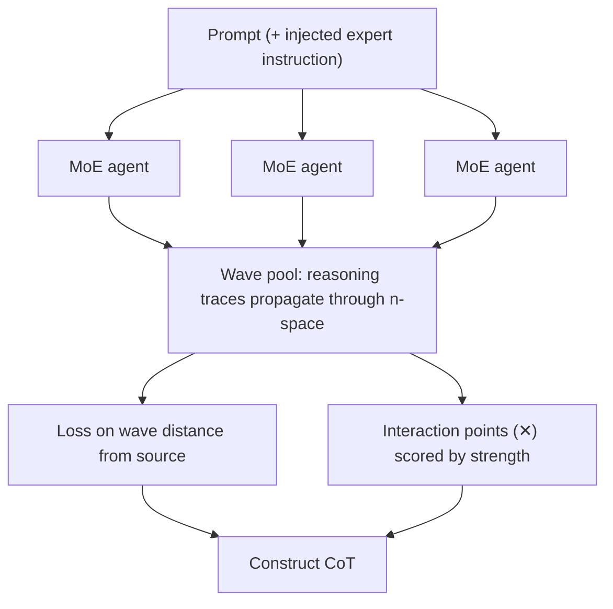

# Wave Convergence Thinking (WCT)

## The sketch

```
                         " . . . "
                              \
                               \____  inject specific
                                     expert instruction
                               |
                               v
   "wave pool"
   ┌──────────────────────────────────────────────────────┐
   │                                                      │
   │    ((( ⊙ )))                        ((( ⊙ )))        │
   │                    ((( ⊙ )))    ✕                    │
   │                            ✕  ((( ⊙ )))              │
   │                                                      │
   │                       ✕            ✕                 │
   │    ((( ⊙ )))     ((( ⊙ )))     ((( ⊙ )))             │
   │                          ✕                           │
   │                    ✕          ✕                      │
   │    ((( ⊙ )))         ((( ⊙ )))      ((( ⊙ )))        │
   │                                                      │
   └──────────────────────────┬───────────────────────────┘
                              │
                              v
                        construct CoT
```

**Legend**

| Symbol | Meaning |
| --- | --- |
| `⊙` | MoE agent |
| `✕` | Wave interaction |

## Mechanics

- Prompt goes to each agent
- Thinking "waves" are exposed
- Waves "travel" across n-space
- Loss function on "wave" distance from source
- Interaction strength highlights "✕"
- Use "wave" interaction strength to construct chain of thoughts

## Flow



---

# Page 2: mapping and open questions

## Loss curve

```
 loss
  1 ┤ ╲
    │  ╲                    ?
    │   ╲
    │    ╲___
    │        ╲______
    │               ╲_____________
  0 ┼──────────────────────────────────
    0                          n? step?
```

Decay shape undecided. x-axis unit undecided (n vs step).

## Mapping wave concepts?

**Blocker:** CoT is not uniform across model architectures.

**Boon:** longer != better, aggressive loss bolsters simplicity bias.

## Propagation

Waves propagate with time + distance.

- Time = thinking time (i.e. tokens consumed)
- Distance = *(blank)*

## Concepts still to map

| Have | To resolve |
| --- | --- |
| Wavelength | Wave velocity? |
| Frequency | Reflection / refraction / diffraction |
| Speed | Dispersion? |

---

# Page 3: worked example

## Rejected sketch

```
   ⊙ ))))))))))))))))))) ⊙          -> doesn't make sense  [struck through]
```

Two sources interfering along a single line. Discarded.

## Interaction sketch

```
        (1)                 (3)
     ((( ⊙ )))         ((( ( ⊙ ) )))
        ✕ ✕ ✕
         ((( ⊙ )))
             (2)
```

**Loss function needs to dictate strength.**

Here CoT1 interacts heavily with CoT2, and once with CoT3, which interacts
with CoT2 heavily.

## Amplitude table

Assume 0.25 loss per step, interaction doubles.

| | Wave 1 | Wave 2 | Wave 3 | Wave 4 |
| --- | --- | --- | --- | --- |
| CoT 1 | 0.25 | 1 | 0.5 | n/a |
| **CoT 2** | **1.5** → | **2** → | **1** → | n/a |
| CoT 3 | 0.25 | 0.50 | 0.25 | **0.25** |

Traced path (the constructed CoT): CoT2 w1 (1.5) → CoT2 w2 (2) → CoT2 w3 (1)
→ CoT3 w4 (0.25).

The selected chain is the highest-amplitude path through the field, and it
switches source mid-chain rather than following any single agent end to end.
